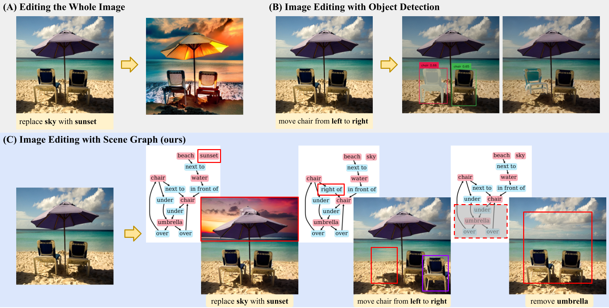

# Complex Scene Image Editing by Scene Graph Comprehension


**SGC-Net** is a scene-graph driven image editing method. This repository contains the implementation of our [paper](https://arxiv.org/pdf/2203.12849.pdf).
If you find this code useful in your research, please consider citing:

    @InProceedings{ZhangSGCNet2023,
         author={Zhongping Zhang and Huiwen He and Bryan A. Plummer and Zhenyu Liao and Huayan Wang},
         title={Complex Scene Image Editing by Scene Graph Comprehension},
         booktitle={British Machine Vision Conference (BMVC)},
         year={2023}}



## Setting up the environment
The first stage of SGC-Net is trained based on PyTorch 1.12.1 with Cuda 11.3.

The second stage of SGC-Net is mainly based on [ControlNet](https://github.com/lllyasviel/ControlNet). Please follow the instruction of ControlNet to set up the environment.


## Datasets:
We performed our experiments on two public datasets, CLEVR-SIMSG and Visual Genome. We provided the versions we employed for model training and evaluation through the following links.

| Datasets      | Google Drive Link                                                                                          |
|---------------|------------------------------------------------------------------------------------------------------------|
| CLEVR-SIMSG   | [CLEVR-SIMSG Link](https://drive.google.com/drive/folders/1nGbVDBnIS7gasiZQwaRIRa6eAZZBvtCr?usp=sharing)   |
| Visual Genome | [Visual Genome Link](https://drive.google.com/drive/folders/1tcoDWbiqPSvK0OqmDuxOTh9iIhBGf6GZ?usp=sharing) |


If you would like to obtain the original data, please consider collect the data from their official websites:
[CLEVR-SIMSG](https://github.com/he-dhamo/simsg) & [Visual Genome](https://homes.cs.washington.edu/~ranjay/visualgenome/index.html)

## Train & Evaluate SGC-Net
### Train and Evaluate RoI Prediction
**Note:** In this repo, we mainly provide the code of the *RoI Prediction* module. The *region-based image editing* module is largely employed in ControlNet environment. We haven't integrated the second stage in this repo.

Run the following script to train and evaluate *RoI Prediction*:
```sh
python triples2roi/train_clevr_triples2roi.py
```

Run the following script to generated predicted bounding boxes:
```sh
python triples2roi/generate_clevr_target_box.py
```

Run the following script to generate masked images, which will be provided as input to the *region-based image editing* module:
```sh
python image_editing_CLEVR.py
```


## Acknowledgement
This code is partially based on the [SIMSG](https://github.com/he-dhamo/simsg) repository.

